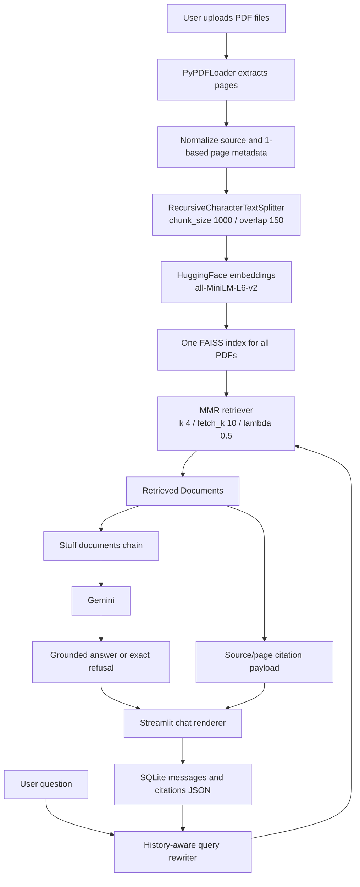

# Aether — AI Knowledge Assistant

> Ask questions across multiple PDFs and receive strictly grounded Gemini answers with page level evidence.

## Live Demo

Link - https://aether-ai-knowledge-assistant.streamlit.app/

## Overview

Finding one reliable answer across several long PDFs is slow: the relevant paragraph may be in a different document, chapter, or page than the one you first open. Aether turns that manual search into a cited question-and-answer workflow for research, project documentation, resumes, and other PDF-only knowledge collections.

Aether extracts PDF pages, splits them into overlapping chunks, embeds the complete upload set into one FAISS index, and uses Gemini to answer from retrieved context. Retrieval uses maximal marginal relevance (MMR), while history-aware query rewriting turns follow-up questions into self-contained searches.

This implementation is intentionally evidence-led: every non-refusal answer is instructed to cite `[filename.pdf, p.N]`, citations are rendered from the retrieved document metadata, and the answer prompt has an exact refusal path when the corpus does not contain enough information. Conversation messages and citation payloads persist in local SQLite history.

## Tech stack

| Layer | Technology | Version |
|---|---|---|
| UI | [](https://streamlit.io/) | `1.44.1` |
| Orchestration | [](https://www.langchain.com/) | `0.3.27` |
| LangChain core | [](https://pypi.org/project/langchain-core/) | `0.3.76` |
| LLM integration | [](https://pypi.org/project/langchain-google-genai/) | `langchain-google-genai 2.1.12` |
| Embeddings | [](https://pypi.org/project/langchain-huggingface/) | `0.3.1` |
| Embedding runtime | [](https://pypi.org/project/sentence-transformers/) | `5.0.0` |
| Vector store | [](https://pypi.org/project/faiss-cpu/) | `faiss-cpu 1.15.1` |
| PDF parsing | [](https://pypi.org/project/pypdf/) | `5.9.0` |
| Persistence | [](https://www.sqlalchemy.org/) | `2.0.36` |
| Text splitting | [](https://pypi.org/project/langchain-text-splitters/) | `0.3.11` |

The complete pinned dependency list is in [requirements.txt](./requirements.txt).

## Why RAG instead of a plain LLM chat

| | Plain LLM chat (ChatGPT, Gemini web, etc.) | Aether |
|---|---|---|
| **Source of truth** | The model's training data - frozen at a cutoff date | Your uploaded PDFs current, private, and specific to you |
| **Knowledge of your documents** | None, unless you paste content into every message | Full corpus indexed once, queried automatically |
| **Answer provenance** | Unverifiable no way to check where a claim came from | Every answer cites `[filename.pdf, p.N]`, traceable to the retrieved passage |
| **Handling "I don't know"** | Often guesses or hallucinates plausibly-worded but false answers | Strict grounding prompt forces an exact refusal when the corpus lacks the answer |
| **Multi-document reasoning** | Limited by context window; you must paste/re-paste content each session | FAISS index holds the full multi-PDF corpus; retrieval pulls only what's relevant per question |
| **Follow-up questions** | Resolves pronouns using only the visible chat window | History-aware retriever rewrites follow-ups into self-contained queries before searching |
| **Persistence** | Conversation lost on tab close (or paid-tier-only history) | SQLite-backed history survives refresh, with rename/delete/restore |
| **Cost per query** | Full model reasoning every time, even for facts already "known" | Cheap local embedding search narrows to relevant chunks before the LLM call |

The core distinction: a plain LLM chat *reasons from memory*. Aether *reasons from evidence* — every claim is checked against retrieved, citable text rather than the model's internal (and unverifiable) recollection of similar documents it saw during training.

## System Architecture



## Key features

- Multi-PDF ingestion into one unified FAISS index.
- PDF-only support through `PyPDFLoader`; `.docx` is not supported.
- MMR retrieval with verified `k=4`, `fetch_k=10`, and `lambda_mult=0.5`.
- History-aware follow-ups that rewrite pronouns and vague references before retrieval.
- Strict grounding prompt with the exact refusal:
  `I cannot find the answer in the provided documents.`
- Page-level citations with filename, page number, and retrieved text snippets.
- SQLite-backed conversations and messages with citation JSON persistence.
- New chat, newest-first history, conversation restore, rename, and delete controls.
- Local single-browser-session history scope; no authentication or multi-user layer.
- “Instrument Panel / Living Archive” UI direction:
  - observatory navy and copper palette
  - ambient cursor-reactive field
  - orbital index statistics scene
  - reduced-motion and static fallbacks
  - accessible semantic text equivalents for visual scenes

## Setup

### Prerequisites

- Python 3.12 recommended and verified for this repository.
- Windows, macOS, or Linux.
- A Google AI Studio API key for Gemini answers.
- A modern browser with JavaScript enabled. The app still provides static scene fallbacks when WebGL or motion is unavailable.

### Create an environment and install dependencies

Windows PowerShell:

```powershell
cd "C:\Users\VISHAL KHUMAR P D\Desktop\Projects"
git clone ".\Ather" ".\Ather-copy"
cd ".\Ather-copy"
py -3.12 -m venv .venv
.\.venv\Scripts\Activate.ps1
python -m pip install --upgrade pip
pip install -r requirements.txt
```

macOS or Linux:

```bash
cd "$HOME"
git clone "$HOME/Ather" "$HOME/Ather-copy"
cd "$HOME/Ather-copy"
python3.12 -m venv .venv
source .venv/bin/activate
python -m pip install --upgrade pip
pip install -r requirements.txt
```

### Configure Gemini

The app checks `GOOGLE_API_KEY` first and then `st.secrets["GOOGLE_API_KEY"]`. Use one of these approaches; do not commit credentials.

PowerShell for the current terminal:

```powershell
$env:GOOGLE_API_KEY = Read-Host "Enter GOOGLE_API_KEY"
```

macOS or Linux for the current terminal:

```bash
read -rsp "Enter GOOGLE_API_KEY: " GOOGLE_API_KEY
export GOOGLE_API_KEY
printf "\n"
```

Alternatively, create `.streamlit/secrets.toml` with a `GOOGLE_API_KEY` string containing your key. Keep that file out of version control.

The installed `python-dotenv` package is part of the pinned environment, but the application does not automatically load a `.env` file. Use the environment variable or Streamlit secrets path above.

### Run

```bash
streamlit run app.py
```

On first use, the `sentence-transformers/all-MiniLM-L6-v2` embedding model is downloaded and cached locally. The download is approximately 90 MB and happens once per environment.

Upload one or more PDFs, press **Build Index**, and then ask a question. A new local `aether_history.db` file is created beside `app.py`; it is ignored by Git.

## Environment variables and configuration

| Variable | Required | Default | Description |
|---|---:|---|---|
| `GOOGLE_API_KEY` | For Gemini answers | Empty | Google AI Studio key read from the process environment. If absent, the sidebar also checks `st.secrets["GOOGLE_API_KEY"]`. |

The SQLite path is not an environment variable in the current implementation. It is fixed to `aether_history.db` beside `app.py` by `HISTORY_DB_PATH`.

## How it works

**Ingestion.** Each uploaded file is written to a temporary directory and loaded with `PyPDFLoader`. The application normalizes the filename into `metadata["source"]` and converts the loader’s zero-based page value into a human-facing one-based `metadata["page"]`.

**Chunking.** Every extracted page is passed through `RecursiveCharacterTextSplitter` with a 1,000-character chunk size and 150-character overlap. LangChain document metadata is carried onto each chunk, preserving the file and page needed for citations.

**Embedding.** The complete chunk list from every uploaded PDF is embedded with `sentence-transformers/all-MiniLM-L6-v2`. The embedding resource is cached with Streamlit’s `@st.cache_resource`, so the model loads once per process.

**Indexing.** `FAISS.from_documents` creates one in-memory vector index from all uploaded chunks. The sidebar reports the number of indexed documents, pages, and chunks.

**Retrieval.** A history-aware retriever first rewrites a follow-up question into a self-contained search query when chat history exists. FAISS then performs MMR retrieval with `k=4`, `fetch_k=10`, and `lambda_mult=0.5`.

**Generation.** The retrieved documents are formatted with explicit `[SOURCE: ... | PAGE: ...]` markers and passed to a Gemini stuff-documents chain. The system prompt forbids outside knowledge and requires the exact refusal sentence when the context is insufficient.

**Citation display.** The answer is rendered as Markdown. Retrieved documents are deduplicated by `(source, page)` and shown in collapsible citation cards containing the filename, page number, and a short evidence snippet. Refusal answers intentionally display no citation cards.

**History persistence.** User and assistant messages are stored in SQLite through SQLAlchemy 2.0. Citation payloads are stored as JSON in the `messages` table. SQLite WAL mode and `check_same_thread=False` support Streamlit’s rerun model. The sidebar restores, renames, switches, and deletes conversations.

## Retrieval configuration

| Setting | Final value |
|---|---|
| Embedding model | `sentence-transformers/all-MiniLM-L6-v2` |
| Chunk size | `1000` characters |
| Chunk overlap | `150` characters |
| MMR `k` | `4` |
| MMR `fetch_k` | `10` |
| MMR `lambda_mult` | `0.5` |

Phase 1 tested extraction, metadata preservation, unified indexing, cached embeddings, five MMR questions across the attached GreenLedger and Resume PDFs, history-aware follow-ups, exact refusal behavior, and citation provenance. All checks passed, so no retrieval parameters were changed speculatively.

## Design decisions worth calling out

- **Citations are extracted from retrieved `Document` objects, not parsed from the LLM's own text.** This means citation accuracy cannot degrade even if answer generation occasionally does — the file/page shown is always ground truth from FAISS, never a model-generated guess.
- **MMR over plain similarity search.** Plain cosine-similarity retrieval on a multi-document corpus tends to return near-duplicate chunks from whichever document is most topically dominant. MMR's diversity term (`lambda_mult=0.5`) actively penalizes redundancy, so a 4-document corpus is more likely to surface evidence from more than one source per query.
- **Refusal is an exact string, not a vague hedge.** The system prompt requires the literal sentence `I cannot find the answer in the provided documents.` rather than open-ended hedging like "I'm not sure" — this makes refusal behavior testable and consistent, and the UI suppresses citation cards specifically on that string match.

## Known limitations

- Gemini free-tier quotas and rate limits can delay or reject requests; the app retries detected rate-limit failures and surfaces actionable errors.
- Chat history is local and single-browser-session in scope. It is not synchronized across devices and has no multi-user authentication.
- Input is PDF-only. `.docx` is intentionally unsupported.
- Scanned/image-only PDFs may produce no usable text because the current pipeline does not include OCR.
- The FAISS index is in memory and must be rebuilt after a fresh process starts.
- The Gemini API key is required for live answers.
- The visual scenes depend on browser JavaScript and may use their static accessible fallback when reduced motion, mobile constraints, unsupported APIs, or CDN availability require it.

## License

MIT License. See [LICENSE](./LICENSE) for the full terms.
